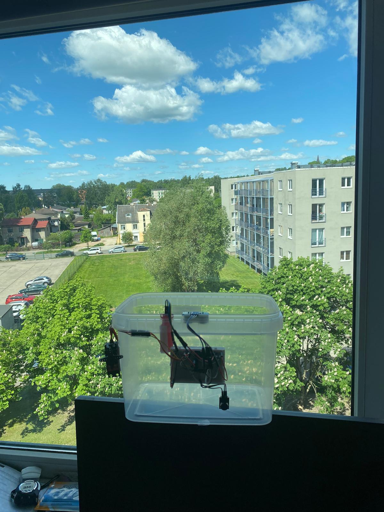
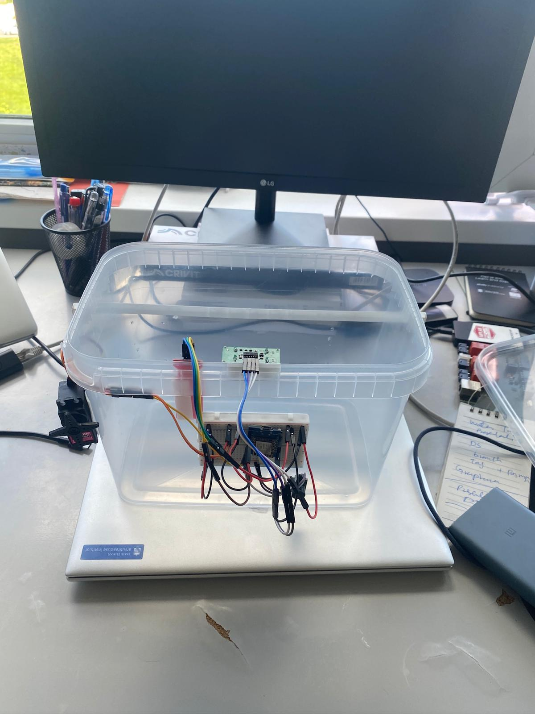
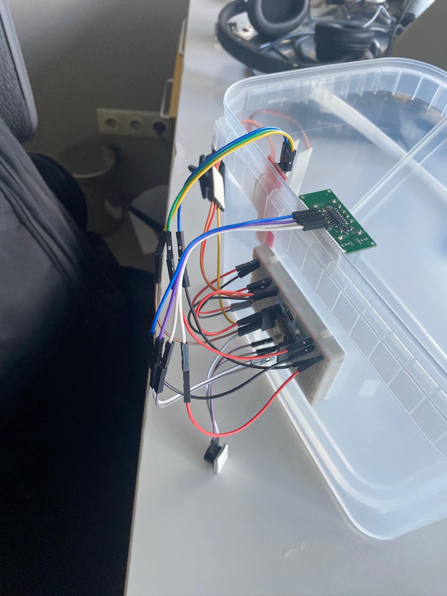
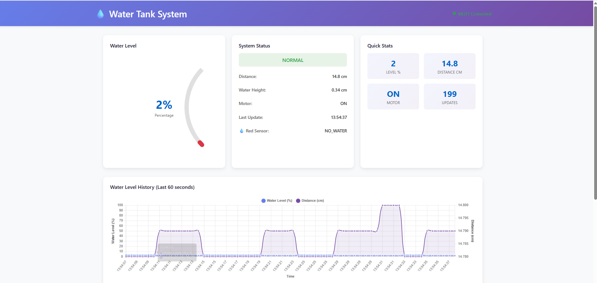

# 💧 Smart Water Tank Monitoring & Overflow Prevention System

> **IoT-Based Automated Water Management for Smart Homes**  
> An intelligent, low-cost solution for real-time water tank monitoring with automatic motor control and overflow prevention.

[](https://opensource.org/licenses/MIT)
[](https://en.wikipedia.org/wiki/ESP8266)
[](https://www.arduino.cc/)
[](https://mqtt.org/)
[](https://www.python.org/)

---

## 📋 Table of Contents

- [Overview](#-overview)
- [Problem Statement](#-problem-statement)
- [Features](#-features)
- [System Architecture](#-system-architecture)
- [Hardware Components](#-hardware-components)
- [Circuit Diagram](#-circuit-diagram)
- [Installation & Setup](#-installation--setup)
- [How It Works](#-how-it-works)
- [MQTT Communication](#-mqtt-communication)
- [Web Dashboard](#-web-dashboard)
- [Usage](#-usage)
- [Project Structure](#-project-structure)
- [Demonstration](#-demonstration)
- [Future Improvements](#-future-improvements)
- [Contributors](#-contributors)
- [License](#-license)

---

## 🎯 Overview

The **Smart Water Tank Monitoring & Overflow Prevention System** is an IoT-based solution designed to automate water tank management in residential and commercial settings. It continuously monitors water levels using ultrasonic sensors, automatically controls motor operations, detects overflow conditions, and provides real-time remote monitoring via MQTT and a responsive web dashboard.

### Key Statistics
- 📡 **Real-time Monitoring**: 2-second update intervals
- 🔌 **MQTT Integration**: Seamless cloud connectivity
- 🎛️ **Automated Control**: Intelligent motor switching logic
- ⚡ **Low Power**: ~5W operational power
- 💰 **Cost-Effective**: ~$25 total component cost
- 🌐 **Remote Access**: Monitor from anywhere

---

## 🔴 Problem Statement

### The Real-World Challenge

In many homes across Pakistan and developing countries, water management is a persistent problem:

- **Manual Process**: Underground water storage tanks are filled by water tankers, and water is manually pumped to rooftop tanks using electric motors
- **Human Dependency**: Someone must physically turn the motor ON and wait until overflow occurs before turning it OFF
- **Water Wastage**: Overflow is treated as a normal signal, wasting thousands of liters daily
- **Safety Risks**: Forgotten motors running overnight can damage equipment
- **Inefficiency**: No data on water consumption or tank status

### Our Solution

This project implements a **practical, deployable IoT solution** that:
- ✅ Automates the entire water filling process
- ✅ Prevents wasteful overflow
- ✅ Provides remote monitoring
- ✅ Sends alerts when water levels are critical
- ✅ Maintains historical data for analytics

---

## ✨ Features

### Core Functionality
| Feature | Description |
|---------|-------------|
| 📊 **Real-Time Monitoring** | Continuous ultrasonic water level measurement |
| 🎮 **Automatic Control** | Intelligent motor ON/OFF logic with configurable thresholds |
| 🚨 **Overflow Detection** | Independent water sensor as safety backup |
| 📢 **Audible Alerts** | Piezo buzzer notifications for critical events |
| 🌐 **Remote Access** | MQTT-based remote monitoring and control |
| 📈 **Live Dashboard** | Beautiful web interface with real-time updates |
| 📱 **Mobile Monitoring** | MQTT apps for iOS/Android (e.g., MQTT Explorer) |
| 🔄 **OTA Updates** | Firmware updates without physical access |
| 📡 **Serial Diagnostics** | Real-time debugging via USB serial connection |

### Intelligence Features
- ✨ **Noise Filtering**: Averaging 5 readings per cycle
- 🔒 **Stable Validation**: Requires 3 consecutive stable readings before action
- 🛡️ **False-Positive Prevention**: Independent overflow sensor confirmation
- ⚙️ **Hysteresis Logic**: Separate ON/OFF thresholds to prevent motor hunting

---

## 🏗️ System Architecture

```
┌─────────────────────────────────────────────────────────────┐
│                    SMART WATER TANK SYSTEM                  │
├─────────────────────────────────────────────────────────────┤
│                                                              │
│  ┌──────────────┐         ┌──────────────┐                  │
│  │  ESP8266     │         │   Sensors    │                  │
│  │ Wemos D1Mini │◄───────►│ • Ultrasonic │                  │
│  │              │         │ • Water Lvl  │                  │
│  │  • WiFi      │         │ • Buzzer     │                  │
│  │  • MQTT      │         └──────────────┘                  │
│  │  • OTA       │                                            │
│  └──────┬───────┘                                            │
│         │                                                    │
│         │ MQTT Publish                                       │
│         ▼                                                    │
│  ┌──────────────────┐                                        │
│  │  MQTT Broker     │◄─────── MQTT Subscribe                │
│  │ (192.168.15.2)   │                                        │
│  └──────┬───────────┘                                        │
│         │                                                    │
│    ┌────┴─────────────────────┐                              │
│    │                          │                              │
│    ▼                          ▼                              │
│  ┌──────────────┐     ┌──────────────────┐                  │
│  │ Mobile MQTT  │     │ Flask Dashboard  │                  │
│  │   Apps       │     │   (Python)       │                  │
│  └──────────────┘     │ • Real-time UI   │                  │
│                       │ • Charts         │                  │
│                       │ • Alerts         │                  │
│                       └────┬─────────────┘                  │
│                            │ HTTP                           │
│                            ▼                                 │
│                       ┌──────────────┐                      │
│                       │   Browser    │                      │
│                       │ Dashboard    │                      │
│                       │:5000         │                      │
│                       └──────────────┘                      │
└─────────────────────────────────────────────────────────────┘
```

---

## 🔧 Hardware Components

### Main Controller
| Component | Model | Purpose |
|-----------|-------|---------|
| Microcontroller | **Wemos D1 Mini** | ESP8266-based, WiFi-enabled IoT controller |
| Sensor | **HC-SR04** | Ultrasonic distance measurement for water level |
| Sensor | **Water Level Sensor** | Overflow detection (safety backup) |
| Actuator | **MG996R Servo Motor** | Motor relay simulation (easily adaptable to real AC relay) |
| Alert | **Piezo Buzzer 5V** | Audible alarm for critical conditions |
| Power | **USB 5V Power Supply** | Development setup (5W typical) |

### Pinout Configuration
```
ESP8266 Wemos D1 Mini Pin Mapping:

D1 (GPIO5)   ──► Buzzer Signal
D2 (GPIO4)   ──► Water Sensor Input
D4 (GPIO2)   ──► Servo Motor PWM
D6 (GPIO12)  ──► Ultrasonic TRIG
D7 (GPIO13)  ──► Ultrasonic ECHO
GND          ──► Common Ground
3.3V/5V      ──► Power Rails
```

---

## 🔌 Circuit Diagram

### Ultrasonic Sensor (HC-SR04)
```
HC-SR04 → ESP8266
─────────────────
VCC (5V)    → 5V
GND         → GND
TRIG (D6)   → GPIO12
ECHO (D7)   → GPIO13
```

### Water Level Sensor
```
Water Sensor → ESP8266
─────────────────────
VCC (3.3V)   → 3.3V
GND          → GND
Signal (D2)  → GPIO4
```

### Servo Motor (Motor Relay Simulation)
```
MG996R Servo → ESP8266
────────────────────
VCC (5V)     → 5V (with capacitor)
GND          → GND
Signal (D4)  → GPIO2 (PWM)
```

### Piezo Buzzer
```
Buzzer → ESP8266
────────────────
VCC (5V) → 5V
GND      → GND
Signal (D1) → GPIO5
```

---

## 🚀 Installation & Setup

### Prerequisites
- Arduino IDE (v1.8.0+)
- ESP8266 Board Package installed
- Python 3.7+ (for dashboard)
- MQTT Broker (Mosquitto recommended)
- USB Cable for ESP8266 programming

### Step 1: Arduino IDE Setup

#### Install ESP8266 Board Package
1. Open Arduino IDE
2. Go to `File` → `Preferences`
3. Add this URL to **Additional Boards Manager URLs**:
   ```
   http://arduino.esp8266.com/stable/package_esp8266com_index.json
   ```
4. Go to `Tools` → `Boards Manager`
5. Search for "ESP8266" and install by ESP8266 Community

#### Install Required Libraries
Go to `Sketch` → `Include Library` → `Manage Libraries` and install:

| Library | Version | Author |
|---------|---------|--------|
| **PubSubClient** | ^2.8 | Nick O'Leary |
| **ArduinoOTA** | (Built-in) | Arduino |

### Step 2: Upload Firmware

1. Clone this repository
2. Open `src/main.cpp` in Arduino IDE
3. Configure WiFi credentials:
   ```cpp
   #define STASSID "Your_WiFi_Name"
   #define STAPSK  "Your_WiFi_Password"
   ```
4. Update MQTT Broker IP (if different):
   ```cpp
   const char* mqtt_server = "192.168.15.2";
   const int mqtt_port = 1883;
   ```
5. Connect ESP8266 via USB
6. Select Board: `Tools` → `Board` → `Wemos D1 Mini`
7. Click **Upload** (Ctrl+U)

### Step 3: Dashboard Setup

1. Navigate to dashboard folder:
   ```bash
   cd dashboard
   ```

2. Install Python dependencies:
   ```bash
   pip install -r requirements.txt
   ```

3. Run the dashboard:
   ```bash
   python app.py
   ```

4. Open browser and visit:
   ```
   http://localhost:5000
   ```

---

## 🔄 How It Works

### Operating Logic

```
START
  │
  ├─► Read Ultrasonic Sensor (Average 5 readings)
  │     │
  │     ├─► Calculate Water Height from Distance
  │     │
  │     ├─► Calculate Water Level Percentage (0-100%)
  │
  ├─► Check Red Sensor Status
  │     │
  │     └─► If HIGH for 1000ms → OVERFLOW DETECTED
  │           │
  │           ├─ Turn Motor OFF (Servo to 90°)
  │           ├─ Sound Buzzer
  │           ├─ Publish "FULL_RED_SENSOR_CONFIRMED"
  │
  ├─► If Motor is ON:
  │     │
  │     └─► If Water Level ≥ 90cm (FULL) for 3 cycles:
  │           ├─ Turn Motor OFF (Servo to 0°)
  │           ├─ Publish "TARGET_FULL_STABLE"
  │
  ├─► If Motor is OFF:
  │     │
  │     └─► If Water Level ≤ 1.5cm for 3 cycles:
  │           ├─ Turn Motor ON (Servo to 0°)
  │           ├─ Publish "LOW_STABLE"
  │
  ├─► Publish All Data to MQTT
  │
  ├─► Wait 2 seconds
  │
  └─► REPEAT
```

### Key Parameters (Configurable)
```cpp
const float SENSOR_TO_BOTTOM_CM = 15.13;    // Sensor distance to tank bottom
const float FULL_WATER_HEIGHT_CM = 11.5;    // Max water height
const float MOTOR_START_HEIGHT_CM = 1.5;    // Minimum water to start motor
const int REQUIRED_STABLE_READINGS = 3;     // Readings to confirm change
const unsigned long RED_SENSOR_CONFIRM_MS = 1000;  // Overflow confirmation time
const unsigned long PUBLISH_INTERVAL = 2000;       // MQTT publish interval
```

---

## 📡 MQTT Communication

### Topic Structure
```
water_tank/status
```

### Published Payload Format
```json
{
  "distance_cm": 5.42,
  "water_height_cm": 9.71,
  "level": 84,
  "status": "NORMAL",
  "red_sensor_confirmed": "NO_WATER",
  "motor": "ON"
}
```

### Field Descriptions
| Field | Type | Range | Description |
|-------|------|-------|-------------|
| `distance_cm` | Float | 0-20 | Raw ultrasonic distance reading |
| `water_height_cm` | Float | 0-11.5 | Calculated water column height |
| `level` | Integer | 0-100 | Water level percentage |
| `status` | String | See below | System operational status |
| `red_sensor_confirmed` | String | "WATER_DETECTED" / "NO_WATER" | Overflow sensor state |
| `motor` | String | "ON" / "OFF" | Motor pump state |

### Status Values
| Status | Meaning |
|--------|---------|
| `NORMAL` | Operating normally, motor controlled by level |
| `TARGET_FULL_STABLE` | Target level reached, motor turned OFF |
| `LOW_STABLE` | Low level confirmed, motor turned ON |
| `FULL_RED_SENSOR_CONFIRMED` | **ALERT**: Overflow detected! Motor OFF, buzzer active |

### Example MQTT Subscriber (Python)
```python
import paho.mqtt.client as mqtt

def on_message(client, userdata, msg):
    print(f"Received: {msg.payload.decode()}")

client = mqtt.Client()
client.on_message = on_message
client.connect("192.168.15.2", 1883, 60)
client.subscribe("water_tank/status")
client.loop_forever()
```

---

## 🌐 Web Dashboard

### Features
- 📊 Real-time water level gauge with color coding
- 📈 60-second historical trend charts
- 🎯 Live status indicators
- 📱 Responsive mobile-friendly design
- ⚡ Auto-refresh every 500ms
- 🔌 MQTT connection status

### Access
```
URL: http://localhost:5000
Port: 5000 (configurable)
Auto-refresh: 500ms intervals
```

### Dashboard Sections

#### Water Level Gauge
- Visual circular gauge showing 0-100%
- Color coded: Red (0-30%) → Yellow (30-70%) → Green (70-100%)
- Real-time percentage display

#### System Status Card
- Current distance reading (cm)
- Water height (cm)
- Motor state (ON/OFF)
- Red sensor status
- Last update timestamp

#### Quick Stats
- Level percentage
- Distance value
- Motor state
- Update counter

#### History Chart
- 60-second rolling window
- Water level trend line
- Distance overlay
- Time-stamped data points

#### Raw Data Display
- Live JSON payload view
- Useful for debugging

---

## 🎮 Usage

### Basic Operation

1. **Start the System**:
   - Power on ESP8266
   - Ensure WiFi connectivity
   - Verify MQTT connection (LED or serial output)

2. **Monitor Remotely**:
   - Open web dashboard: `http://localhost:5000`
   - Or use MQTT client app (iOS/Android)
   - Subscribe to `water_tank/status`

3. **Tank Filling**:
   - System automatically starts motor when level drops below threshold
   - Automatically stops motor when level reaches target
   - Red sensor acts as emergency overflow protection

4. **Alerts**:
   - Buzzer sounds when overflow is detected
   - Dashboard shows red status badge
   - MQTT status updates to "FULL_RED_SENSOR_CONFIRMED"

### Serial Debugging
Connect to ESP8266 via USB and monitor serial output (115200 baud):
```
Distance: 5.42 cm | Water height: 9.71 cm | Level: 84% | Red raw: NO | Red confirmed: NO | Status: NORMAL | Motor: ON
```

### OTA Firmware Updates
After initial upload, update via WiFi:
1. Connect ESP8266 to network
2. In Arduino IDE: `Tools` → `Port` → Select ESP8266 (over network)
3. Upload as usual - no USB needed!

---

## 📁 Project Structure

```
WaterTankMonitoringSystem/
├── README.md                          # This file
├── LICENSE                            # MIT License
├── platformio.ini                     # PlatformIO configuration
│
├── src/
│   └── main.cpp                       # ESP8266 firmware
│
├── include/
│   └── README                         # Include files directory
│
├── lib/
│   └── README                         # Libraries directory
│
├── dashboard/                         # Web Dashboard (Python Flask)
│   ├── app.py                        # Flask backend + MQTT listener
│   ├── requirements.txt               # Python dependencies
│   ├── README.md                      # Dashboard documentation
│   │
│   ├── templates/
│   │   └── index.html                # Dashboard HTML template
│   │
│   └── static/
│       ├── css/
│       │   └── style.css             # Dashboard styling
│       │
│       └── js/
│           └── app.js                # Frontend real-time updates
│
├── test/
│   └── README                         # Test files directory
│
└── docs/
    ├── MQTT_PROTOCOL.md              # Detailed MQTT specs
    ├── TROUBLESHOOTING.md            # Common issues & solutions
    └── CIRCUIT_DIAGRAM.md            # Detailed pin mappings
```

---

## 🎯 Future Improvements

### Near Term (v2.0)
- [ ] Real AC relay integration for actual motor control
- [ ] Mobile application (React Native or Flutter)
- [ ] Push notifications (via Firebase Cloud Messaging)
- [ ] User authentication & role management
- [ ] Multiple tank support

### Medium Term (v3.0)
- [ ] Time-series database integration (InfluxDB)
- [ ] Advanced analytics & water usage reports
- [ ] Predictive maintenance alerts
- [ ] Integration with smart home systems (Home Assistant, Node-RED)
- [ ] Telegram/WhatsApp bot notifications
- [ ] Weather-based optimization

### Long Term (v4.0)
- [ ] Solar-powered deployment
- [ ] Leak detection sensors
- [ ] Water quality monitoring (TDS, pH, Turbidity)
- [ ] ML-based consumption prediction
- [ ] Smart billing integration
- [ ] Cloud dashboard (AWS/Azure)
- [ ] Multi-node mesh networking
- [ ] Historical data visualization & reporting

### Advanced Features
- Machine learning anomaly detection
- Integration with municipal water supply data
- Smart scheduling based on usage patterns
- Water conservation recommendations

---

## 📊 Demonstration

### Hardware Prototype

#### Circuit & Assembly Images

| Image 1 | Image 2 | Image 3 |
|---------|---------|---------|
|  |  |  |

*Showing:*
- Wemos D1 Mini microcontroller setup
- Ultrasonic sensor and water sensor integration
- Servo motor and buzzer connections
- Complete breadboard circuit layout

### Dashboard Screenshots

#### Main Dashboard Interface


*The dashboard displays:*
- Real-time water level gauge with color-coded status
- Live sensor readings (distance, water height, motor state)
- Historical water level trends over the last 60 seconds
- System status indicators and MQTT connection status
- Responsive design that works on desktop, tablet, and mobile devices

### Project Presentation

📊 **Full Project Presentation**: [Smart_Water_Tank_Presentation.pptx](Presenatation/Smart_Water_Tank_Presentation.pptx)

*Includes:*
- Problem statement and motivation
- Hardware and circuit design
- System architecture overview
- MQTT protocol explanation
- Dashboard features walkthrough
- Test results and performance metrics
- Future improvements roadmap
- Q&A section

---

## 🤝 Author

- **Muhammad Haris Irfan**

### Acknowledgments
Special thanks to:
- my classmate Muhammad Zain.
- Arduino community for excellent documentation
- Adafruit for sensor libraries
- MQTT.org for protocol specifications
- University faculty for guidance and support

---

## 📜 License

This project is licensed under the **MIT License** - see the [LICENSE](LICENSE) file for details.

### MIT License Summary
Free to use, modify, and distribute with attribution. Perfect for educational and commercial projects.

```
MIT License

Copyright (c) 2026 Muhammad Haris Irfan

Permission is hereby granted, free of charge, to any person obtaining a copy
of this software and associated documentation files (the "Software"), to deal
in the Software without restriction, including without limitation the rights
to use, copy, modify, merge, publish, distribute, sublicense, and/or sell
copies of the Software, and to permit persons to whom the Software is
furnished to do so, subject to the following conditions:

The above copyright notice and this permission notice shall be included in all
copies or substantial portions of the Software.
```

---

## 📞 Support & Contact

### Getting Help
- 📖 Check [TROUBLESHOOTING.md](docs/TROUBLESHOOTING.md) for common issues
- 🐛 Report bugs via GitHub Issues
- 💡 Request features via GitHub Discussions
- 📧 Contact: harisirfanafzalbutt@gmail.com

### Quick Links
- 🌐 [MQTT Protocol Details](docs/MQTT_PROTOCOL.md)
- 🔌 [Circuit Connections](docs/CIRCUIT_DIAGRAM.md)
- 📚 [Dashboard Documentation](dashboard/README.md)

---

## 🎓 Educational Value

This project demonstrates:
- **IoT Fundamentals**: WiFi connectivity, MQTT messaging
- **Embedded Systems**: Real-time sensor interfacing
- **Control Systems**: Feedback loops and automation logic
- **Full-Stack Development**: Hardware + Backend + Frontend
- **Problem Solving**: Real-world engineering challenges
- **System Design**: Architecture and scalability


---

## 📈 Statistics

| Metric | Value |
|--------|-------|
| Total Development Time | ~40 hours |
| Hardware Cost | ~$25 USD |
| Power Consumption | ~5W |
| Update Frequency | 2 seconds |
| MQTT Payload Size | ~150 bytes |
| Dashboard Load Time | <500ms |
| Sensor Accuracy | ±2cm |

---

## 🔐 Security Notes

### Current Setup (Development)
- ⚠️ WiFi credentials in code (not recommended for production)
- ⚠️ No MQTT authentication
- ⚠️ HTTP dashboard (not HTTPS)

### Production Recommendations
- Use WiFi credential storage (EEPROM/SPIFFS)
- Enable MQTT username/password authentication
- Deploy dashboard behind HTTPS reverse proxy
- Use firewall rules to restrict access
- Implement rate limiting on API endpoints

---

## 📝 Notes

### Calibration
Each installation requires calibration:
- Measure actual `SENSOR_TO_BOTTOM_CM` distance
- Measure `FULL_WATER_HEIGHT_CM` from your tank
- Adjust thresholds in `main.cpp`
- Test multiple cycles before deployment

### Performance Considerations
- Ultrasonic readings are averaged over 5 measurements
- Debouncing prevents false motor switches
- MQTT updates every 2 seconds (configurable)
- Dashboard refreshes every 500ms

---

<div align="center">

### ⭐ If you find this project useful, please give it a star!


[⬆ Back to Top](#-smart-water-tank-monitoring--overflow-prevention-system)

</div>
